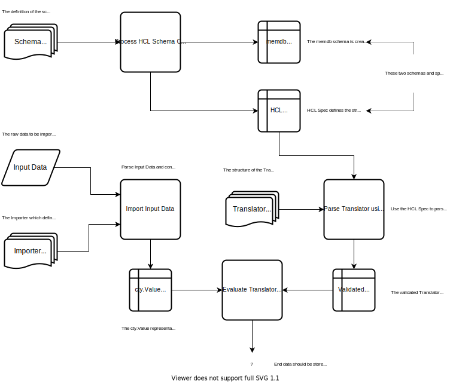

# Bubbly Implementation

This document provides details on the implementation of Bubbly.

## 1. Overview

Considerable inspiration has been taken from HashiCorp's approach to developing software and a similar model has been adopted for Bubbly.

Thus, a couple of high-level points:

1. Bubbly will be written in Go and will be shipped as a single binary
2. All configurations will be provided using the [HashiCorp Configuration Language (HCL)](https://github.com/hashicorp/hcl)
3. HashiCorp's [go-memdb](https://github.com/hashicorp/go-memdb) library will be used as an in-memory schemaful database

A lot of inspiration will be drawn from tools like [Vault](http://github.com/hashicorp/vault), [Nomad](http://github.com/hashicorp/nomad) and [Terraform](http://github.com/hashicorp/terraform) to drive the direction of Bubbly.

## 2. Software Architecture

Bubbly provides a Command Line Interface implemented in Golang.
For this, the obvious choice is to use [cobra](https://github.com/spf13/cobra) and [viper](https://github.com/spf13/viper) to create an experience similar to that which Docker and Kubernetes provide, with an easy abilit to create sub-commands.

It is quite a smart choice to structure the software architecture according to these commands, as it makes the cognitive effort to understand the source code much easier.
Hence, there should be quite a clear mapping between a command that the Bubbly CLI provides and its underlying implementation in a Golang package.
E.g. the `server` command to start the Bubbly server will be implemented in a package called `server`.

### 2.1 Bubbly commands

The following are the commands that bubbly should support.
That is, if you can run `bubbly COMMAND` from the command line.

1. server - starts a Bubbly server
2. upload - uploads data to the Bubbly server
3. query - executes a Bubbly query to return some data
4. status - display the status of the Bubbly server
5. version - prints version information

### 2.2 Bubbly packages

Given the Bubbly CLI commands in the above section, let's look at the different packages for Bubbly to come up with a Software Architecture Design.

Here's a list of the packages for Bubbly:

1. **api** - implements the RESTful API that clients interact with, and delegates all logic to other packages
2. **cmd** - defines the CLI commands using cobra and viper
3. **data** - responsible for fetching input data from multiple sources (input), and also for converting data before sending to client based on a query (output)
4. **db** - responsible for handling the backend database input and output, based on the schema defined in bubbly
5. **importer** - implements the importer that converts input data to a `cty.Value` representation that can be used by the `translator`
6. **translator** - implements the translator that translates the `cty.Value` representation of the input data into the schema
7. **logging** - responsible for setting up logging
8. **schema** - responsible for creating the schema to be used as bubbly's data model, based on provided HCL schema
9. **server** - main package for implementing bubbly's server functionality
10. **upload** - main package for implementing bubbly's client upload functionality
11. **query** - main package for implementing bubbly's client query functionality

### 2.2.1 Importer

