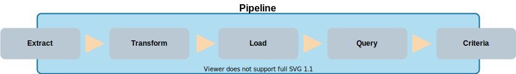
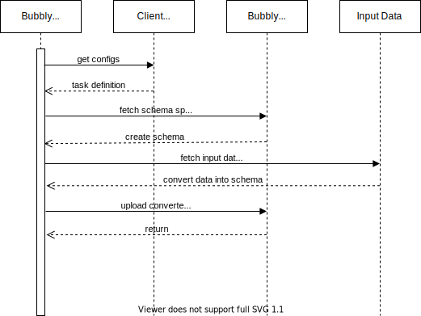
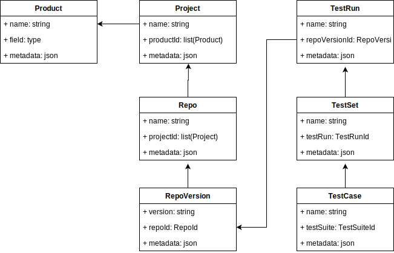
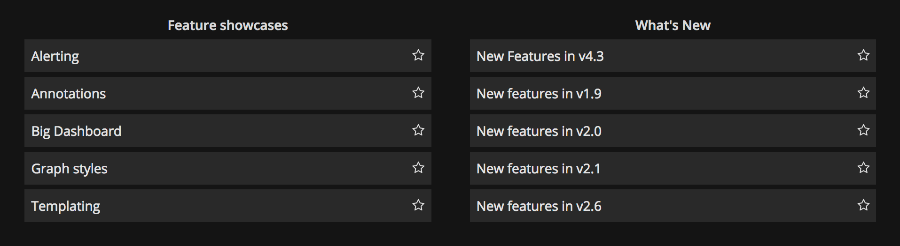
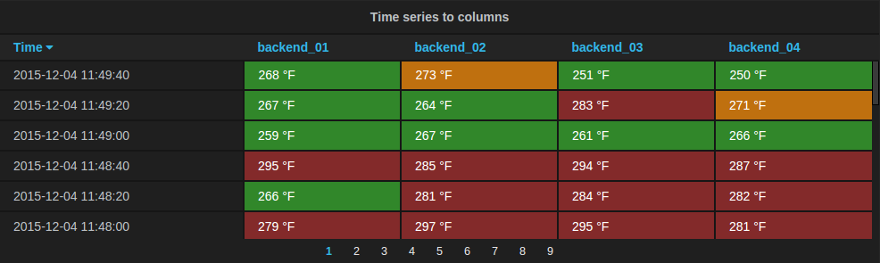
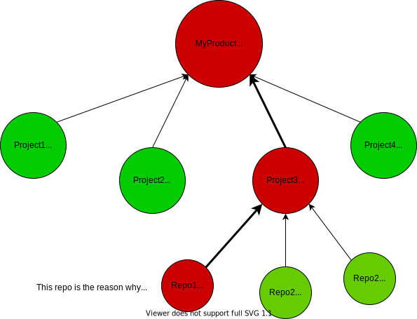

# Bubbly Specification

**Bubbly - Release Readiness in a bubble**

Bubbly provides a declarative approach for defining metrics associated with *release readiness* to be aggregated and queried to objectively answer the important question: *"Are we ready for a release?"*.

In the case that *"we are not ready"* then Bubbly should provide the data which causes this to be the case and answer the question: *"Why are we not ready for a release?"*

This specification is more concerned with describing what Bubbly is and how it will be used.
This specification is not concerned with how Bubbly will be implemented.
For that, see the [implementation documentation](./IMPLEMENTATION.md).

## 1. Introduction

### 1.1 Overview

All software development projects create data regarding the release readiness of the software.
Simple examples like running automated tests and security scans as part of Continuous Integration create results that need to be monitored and acted upon, and those results need to be associated with some data source (such as source code, Docker images, or even a production environment).

Tools exist for aggregating this data but we have experienced a need to *re-invent the wheel* for every project because of different needs, different tools and the fact that the tools we use to aggregate this data were never really made for this exact purpose.
Typical databases that we see tailored for this approach include ElasticSearch, PostgreSQL and Prometheus.
This requires integrations to be developed to populate these databases and teams end up maintaining a collection of utlity scripts, often very specific to the team or organisation.

The goal of Bubbly is to drastically minimise the need to re-invent the wheel each time, and minimise the burden of maintaining lots of scripts and utilities to aggregate data into a queryable backend.

### 1.2 Terminology

- Bubbly - name of this project
- HCL - [HashiCorp Configuration Language](https://github.com/hashicorp/hcl)
- CI - Continuous Integration
- API - Application Programming Interface

### 1.3 Project Contribution

We consider this problem worth solving because we want to make metrics associated with *release readiness* actionable through an API, so that they can be built into the development process.

Development teams will be able to integrate Bubbly into their release process, whether automated or not, allowing data related to release readiness to be collected and aggregated into a single, queryable interface.
Then, whether through an automated deployment or a manual delivery of software, the API to Bubbly should be able to objectively answer a very important question: *"Are we ready for a release?"*

An additional benefit to aggregating data into a queryable API is that dashboards can be created using tools like Grafana and Kibana to visualize any particular metrics of interest.

## 2. Architecture

The high-level architecture for Bubbly consist of the following parts:

1. The **Bubbly Server** is a long-running backend process that is available to upload new data or return data based on a provided query.

2. The **Bubbly Client** is executed in an automated manner (e.g. CI pipeline) or manually by a user to perform operations against the Bubbly Server.

3. The **Bubbly Web UI** will be how the data is represented. The idea is to create a Grafana plugin, for the rich and real-time dashboards. Bubbly will also provide a minimal UI to explore the data, but will not be so feature rich (at least in the beginning).

These main components can be illustrated using the following simple diagram:


The other relevant parts in this diagram are:

1. The **Client Configs** tell the Bubbly client everything it needs to know about to operate. This includes: the location of the *Bubbly server*, where the *input data* is, what to upload to the *Bubbly server*, etc. All the client configs are defined in HCL files.
2. The **Data Source** is the data which should be uploaded to the Bubbly server and can come from any source, such as a JSON or XML file, by querying a REST API or by executing a command line tool. Before it is uploaded it needs to be converted into the expected format, which is defined by the *schema*, and the *extracts* are used to convert the data.
3. The **Schema** defines the format to store the data in Bubbly. It is not strictly SQL but follows a similar approach of defining tables with relations. The schema is defined using HCL and uploaded to the Bubbly server or provided as a config during startup.
4. The **Resources** are the drivers for the data pipeline and consist of the extracts, transforms, loads, pipeline and so on.

All of the configurations, schemas, extracts and such are defined as HCL, which provides the necessary high level abstraction to make configuring Bubbly easy, but still provides the necessary flexibility to process lots of different types of data.

The main resources involved in defining a data pipeline can be illustrated by the following pipeline:



The above architecture can be further elaborated using the following sequence diagram:



## 4. Design

This section describes some design aspects of Bubbly.

## 4.1 Data Model and Schema

To help describe the design of Bubbly we will use the data model illustrated below, which is a subset of the overall model for modelling testing results, such as those from an automated test suite.
Such an example could be adapted to suit any type of test result data, whether it be static analysis of source code, or scanning for 3rd party components, or issues related to infrastructure.



In this example we have a Product, which can have many Projects.
Repo can belong to many Projects, and they have a version (e.g. Git commit) through RepoVersion.
The model for the automated test results is modelled by a TestRun associated with a RepoVersion, which has TestSet which include TestCases.
This simple data model would allow us to store automated test results from a test run that is associated with a verison of source code in a repository.

This data model should be defined as a **schema** using HCL, and the following is an example of such a schema:

```hcl
// flat list
table "product" {
    field "name" { /* ... */ }
}

table "project" {
    field "name" { /* ... */ }
    // relations using something like a foreign key
    field "product_ids" {}
}

// nested relations
table "repo" {
    field "name" { /* ... */ }
    field "project_ids" {}

    table "repo_version" {
        field "name" { /* ... */ }
        field "version" { /* ... */ }
        // repo_id is automatically added as repo_verison is nested under repo
        // field "repo_id" { /* ... */ }
    }
}

table "test_run" {
    field "name" {}
    field "repo_version_id" {}

    table "test_set" {
        field "name" {}

        table "test_case" {
            field "name" {}
            field "status" {}
            field "test_set_id" {}
        }
    }
}
```

This schema should be stored in the Bubbly server so that it can be fetched by the Bubbly Client.
It can either be uploaded after the Bubbly server starts, or can be provided as a configuration during startup.

### 4.2 Extracts

The purpose of Extracts is to extract and convert input data, such as report files produced by different tools.

If we continue on the example of test automation, a common result format for automated tests is that produced by the different [xUnit](https://en.wikipedia.org/wiki/XUnit) tools, such as [JUnit](https://junit.org/junit5/), which is an XML file syntax looking something like the following:

```xml
<!-- SOURCE: https://gist.github.com/n1k0/4332371 -->
<?xml version="1.0" encoding="UTF-8"?>
<testsuites duration="50.5">
    <testsuite failures="0" name="Untitled suite in /Users/niko/Sites/casperjs/tests/suites/casper/agent.js" package="tests/suites/casper/agent" tests="3" time="0.256">
        <testcase classname="tests/suites/casper/agent" name="Default user agent matches /CasperJS/" time="0.103"/>
        <testcase classname="tests/suites/casper/agent" name="Default user agent matches /plop/" time="0.146"/>
        <testcase classname="tests/suites/casper/agent" name="Default user agent matches /plop/" time="0.007"/>
    </testsuite>
</testsuites>
```

We could produce an extract using the following HCL specification.

```hcl
extract "xunit_report" {
    type = "xml"
    format = object({
        testsuites: object({
            duration: number,
            testsuite: list(object({
                failures: number,
                name: string,
                package: string,
                tests: number,
                time: number,
                testcase: list(object({
                    classname: string
                    name: string
                    time: number
                }))
            }))
        })
    })
}
```

### 4.3 Transforms

A transform takes the output from an `extract` and transforms that data according to the defined `schema`.

TODO: make transforms like functions (modules in TF) with inputs, so that all you do to use a transform is provide the inputs/parameters when providing the client configs.

```hcl

inputs {
    test_run_name {}
    repo_version_id {}
}

transform "xunit_report" {
    extract = "xunit_report"

    // this should not be read in detail, as it is not defined properly and needs some
    // of bubbly's magic sauce to make it work, but this should give you an idea
    transform {
        // the data label needs to match a table name, e.g. this data will be
        // associated with the "test_run" table
        data "test_run" {
            name = nil // this should be defined during execution
            repo_version_id = nil // this should be defined during execution

            data "test_set" {
                // do something like setproduct to make the data ready to process in HCL
                // https://www.terraform.io/docs/configuration/functions/setproduct.html
                // idea is to do as much heavy liftin on the extract and make the
                // consumption of the extract as easy as possible, and keep things DRY

                // flatten the testsuites list of lists, and iterate over it
                for_each = setproduct(extract.xunit_report.testsuites.testsuite)
                name = each.name

                data "test_case" {
                    name = each.testcase.name
                }
            }
        }
    }
}
```

### 4.4 Client Configs

The client configs tell the Bubbly client what data to upload to the Bubbly server.

First we would need to provide some of the contextual data, such as the project name, the repository name, the version of the code and generic things which themselves have nothing to do with parsing data, but will feed into the schema and data model.
As the transforms are defined as reusable modules, we only need to provide the necessary inputs (or parameters) to the transform in the client configs.

In the following short example we:

1. First set the Bubbly server to connect to (should be possible to use env vars or similar).
2. Set the name of the `repo` to `test-repo`. The idea is that if this `repo` already exists on the Bubbly server then it would associate the data we are about to produce with that existing `repo`, and not create a new `repo` -- so the Bubbly client will need to query the Bubbly server before uploading.
3. Next we create a `repo_version`, which may exist if we have already uploaded data against the same `repo_version`.
4. Next we specify the module (or transform) that we want to use, and then provide the inputs in the `modules` block.

```hcl

server "bubbly_server" {
    url = "https://api.bubbly.dev"
}

// retrieve the repo called "test-repo"
// bubbly should also support a native git integration to fetch this
// information automatically
data "repo" "test_repo" {
    name = "test-repo"
}

// create a repo_version
data "repo_version" "test_version" {
    version = env.GIT_COMMIT
    source_repo_id = data.source_repo.test_repo.id
    metadata {
        branch = env.GIT_BRANCH
    }
}

modules "xunit_report" {
    transform {
        source = server.bubbly_server.transforms
        // or maybe just the local source?
        // source = "../../relative/path/to/xunit_report
    }

    test_run_name = "test-run-${env.JOB_NUMBER}"
    repo_version_id = data.repo_version.test_version.id
}

```

### 4.5 Queries

Once a suitable data model has been created and data has been populated using the client configs and extracts, it is time to make use of this data.

Queries are defined as HCL and can be sent to the Bubbly server and the Bubbly server will process the query and return the relevant data.

TODO: this needs to be better defined, but using HCL it is possible to do this a number of ways.

### 4.5 Dashboard and UI

As well as providing queries that can be integrated into your release process and pipelines, Bubbly will also provide a dashboard and UI.

For the full-featured dashboard we will support Grafana and create a plugin.
Bubbly will also come with a less powerful built-in UI for exploring the data and configurations on the Bubbly server.

#### 4.5.1 Grafana

The idea will be to develop a Grafana [App Plugin](https://grafana.com/docs/grafana/latest/developers/plugins/) to provide both a new data source (the Bubbly server) but also new panels.

Firstly, users can create a standard [Dashboard list](https://grafana.com/docs/grafana/latest/panels/visualizations/dashboard-list-panel/) as an entry point for Bubbly.



And an example dashboard could be a [Table panel](https://grafana.com/docs/grafana/latest/panels/visualizations/table-panel/) that would show a list of versions for a product, and an indicator of their release readiness.



The main visualisation that Bubbly will offer will be related to the data structure that that you define.
For example, something like the following:



Grafana provides [Data Links](https://grafana.com/docs/grafana/latest/linking/data-links/) and the idea would be that you can click on any `NOT READY` bubble, or cell in a table, and it will take you to the data as to *why* it is not ready.

This answers the follow up question, that if we are not ready for a release: *"Why are we not ready for a release?"*

#### 4.5.2 Bubbly Built-in UI

The built-in Bubbly UI will not be for the same purpose as the Grafana integration.
Instead, it is made for the development of Bubbly HCL files and for investigating the data, schemas, extracts, transforms, etc.

As such, the built-in UI will be very minimalistic and very lightweight, and can be disabled if wanted.
