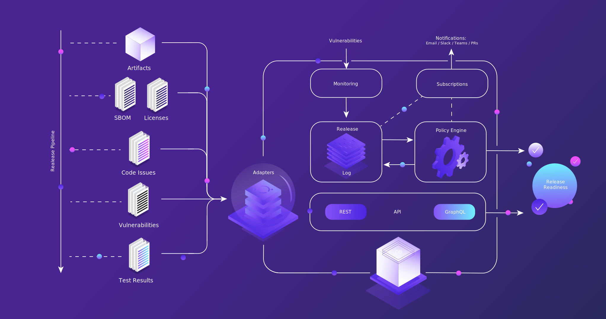

## Bubbly - Release Readiness in a Bubble

Bubbly is a release readiness platform helping software teams release compliant software with confidence. Gain visibility into your release process with reports and analytics to lower risk, increase quality, reduce cycle time and drive continuous improvement.

**Release Readiness** is a term that we use to define the state of being ready to release software. This project aims at helping teams help teams define their Release Readiness policies (using the [Rego Policy Language](https://www.openpolicyagent.org/docs/latest/policy-language/)), collect the data to enforce those policies, and measure their performance getting to their Release Readiness goals (whether it be speed or stability).

## How it works

Bubbly's main entity is the `Release` entity. A Release has a one-to-one relationship with a version of your software (i.e. commit) and the purpose of the release is to collect all the data we want to inform our Release Readiness decision.

Getting data in to Bubbly was one of the core challenges faced, and the `Adapters` are the solution here.
After much work with different config languages, we landed on the [Rego Policy Language](https://www.openpolicyagent.org/docs/latest/policy-language/) for the adapter implementation and it works really well.
Check the [documentation on adapters](https://docs.bubbly.dev/adapters/adapters) for more.

For each type of result that is "adapted" into Bubbly and added to a release, a `release entry` is created which forms the release log.
Also, every time a new piece of data is added to a release, the policies that apply to that release are re-evaluated and any violations created.
Policies use the [Rego Policy Language](https://www.openpolicyagent.org/docs/latest/policy-language/) which is great for defining rules such as `require` (stating that some event needs to happen) and `deny` (defining something that cannot happen in a release). Also violations have a severity, so you can create suggestions, warnings and blockers.

Subscriptions can be created to inform about new events in Bubbly (such as a failed release, or a new vulnerability).
Also a GraphQL interface exists to help extract data from Bubbly.
One of our design goals is to have the right data in the right place at the right time, and therefore getting data out of Bubbly to integrate into your existing process (dashboards, PRs) is something we want to make possible.

## Motivation

### Problem Statement

The problem around Release Readiness is one of data. All the tools used in the software process produce data, and that data should be used to drive the Release Readiness decision.

The real problem is that this data gets scattered all over the place which results in:

1. Broken relationships across the data
2. Non-standard interfaces which make accessing the data hard (sometimes impossible)
3. Overhead maintaining multiple data stores and data bases, ensuring that the data is up to date and accurate
4. Lack of understanding of the data's hierarchy

### Proposed Solution

Bubbly has been built to address the core problems mentioned above. This has been achieved by implementing a simple engine built over the [Rego Policy Language](https://www.openpolicyagent.org/docs/latest/policy-language/) with a versatile database schema, built using [entgo](https://entgo.io/).

A GraphQL and standard REST API are provided to help get data out, as one design goal of bubbly is putting the right data in the right place.

The data in Bubbly can now be used to make automated decisions in pipelines (e.g. check that results are good) and can be used to power dashboards. Any dashboard that supports GraphQL (like [Grafana](https://grafana.com/grafana/)) can be used to visualize the data. Bubbly also ships with its own UI, and this was born out of the need to understand the data hierarchy (something that ordinary dashboards do not do too well with).

Check out the [Core Concepts](core-concepts.md) for more information on things like the adapters, policies and more.

### Goals

The goal of Bubbly was to be a "bridge" between data, and make connecting and accessing data related to release readiness as simple, reliable and fun as possible!

We are not aiming to replace every tool you are already using, in fact, without other tools Bubbly itself is useless. The goal is to complement every other tool by making their data more accessible.

Some ways in which Bubbly could be used are:

* Collect all relevant release readiness data from your release process (artifacts, test results, Software Bill of Material, etc.).
* Create a decision protocol to formally define your Release Readiness Policy, and automatically apply that to all projects/repositories.
* Catalogue of OSS components, licenses, Vulnerabilities and approvals/rejections for those.
* Help teams develop their continuous practices by profiling the current process to identify bottlenecks and possible performance gains.

If you have some ideas or questions for things you want to solve, please raise an issue in the [Discussion](https://github.com/valocode/bubbly/discussions) and we'll check it out :)

### Non-Goals

The things that Bubbly is not aiming to be:

* A testing tool/framework.
* A traditional monitoring tool (think Ops metrics, like Prometheus).
* Another dashboard (like Grafana).
  
## Project Status

This project is currently in **Alpha**

In terms of stability, the existing features should work and if they do not please raise an issue. Also we do not guarantee backwards compatability with the APIs and schema.

In terms of feature completeness, we are working on implementing the core features of Bubbly, and hence there are missing features, such as Subscriptions and Monitoring of vulnerabilities.

If you are interested in getting involved in the project, or want some help getting started, please reach out to us though our website: [https://bubbly.dev](https://bubbly.dev)

## Architecture

See the [ARCHITECTURE.md](https://github.com/valocode/bubbly/blob/main/ARCHITECTURE.md) file for the structure of this repository.

## Why Open Source?

Bubbly is open source, licensed under the [Mozilla Public License v2](LICENSE).

We have a few reasons for being open source:

1. The team and company behind Bubbly are all big fans of open source, so it was never really considered not making it open source.
2. We want to focus on building the best product, and we firmly believe making the project OSS will help us achieve this.

## Install

See our [Installation Guide](../getting-started/getting-started.md#installation).

## Getting Started

See our [Getting Started Guide](../getting-started/getting-started.md).

## Contributing

See our [Contributing Guide](contributing.md).

## License

[Mozilla Public License Version 2.0](LICENSE)
